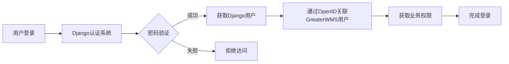

# GreaterWMS 密码安全说明文档

## 📋 文档概述

本文档详细说明了GreaterWMS仓库管理系统中用户密码的存储方式、安全机制以及相关的最佳实践。

## 🔒 密码存储安全性

### 1. 加密算法

GreaterWMS采用Django框架的标准密码哈希机制：

- **算法：** PBKDF2-SHA256
- **迭代次数：** 1,000,000次
- **盐值：** 每个密码使用独特的随机盐值
- **格式：** `pbkdf2_sha256$迭代次数$盐值$哈希值`

### 2. 密码示例对比

```text
原始密码：admin123456
存储格式：pbkdf2_sha256$1000000$Kp1704lAaeWEFPKchaylts$Zkr57iNQYCH9qBWK1ZzF+YdgDBNVu7XiV1JJuhvYcek=
长度：89个字符
```

**特点：**
- ✅ 不可逆：无法从哈希值反推出原始密码
- ✅ 唯一性：即使相同密码，哈希值也不同（因为盐值不同）
- ✅ 抗攻击：抵御彩虹表攻击和暴力破解

## 🏗️ 系统架构

### 数据库表结构

GreaterWMS使用双层用户系统：

#### 1. Django用户表 (auth_user)
```sql
-- 负责身份认证
CREATE TABLE auth_user (
    id INTEGER PRIMARY KEY,
    username VARCHAR(150) UNIQUE,
    password VARCHAR(128),  -- 存储哈希密码
    email VARCHAR(254),
    is_active BOOLEAN,
    is_staff BOOLEAN,
    is_superuser BOOLEAN,
    date_joined DATETIME,
    last_login DATETIME
);
```

#### 2. GreaterWMS用户表 (user_profile)
```sql
-- 负责业务权限管理
CREATE TABLE user_profile (
    id INTEGER PRIMARY KEY,
    name VARCHAR(80),
    vip BIGINT,
    openid VARCHAR(100),  -- 关联标识，非密码
    appid VARCHAR(100),
    developer BOOLEAN,
    create_time DATETIME,
    update_time DATETIME
    -- 注意：此表不存储密码
);
```

### 认证流程



## 👥 用户权限体系

### VIP等级说明

| VIP等级 | 权限描述 | 用户角色 | Developer标志 |
|---------|----------|----------|---------------|
| 9 | 超级管理员权限 | 系统管理员 | ✅ |
| 7 | 高级管理权限 | 仓库经理 | ✅ |
| 3 | 基础操作权限 | 仓库操作员 | ❌ |
| 1 | 只读查看权限 | 查看用户 | ❌ |

### 当前用户列表

| 用户角色 | 用户名 | 密码 | VIP等级 | 创建时间 |
|---------|--------|------|---------|----------|
| 系统管理员 | admin | admin123456 | 9 | 2025-09-09 |
| 仓库经理 | manager | manager123 | 7 | 2025-09-09 |
| 仓库操作员1 | operator1 | operator123 | 3 | 2025-09-09 |
| 仓库操作员2 | operator2 | operator123 | 3 | 2025-09-09 |
| 查看用户 | viewer | viewer123 | 1 | 2025-09-09 |

## 🛡️ 安全特性

### 1. 密码哈希安全性

- **PBKDF2算法：** 业界标准的密码派生函数
- **SHA-256：** 安全的哈希函数
- **高迭代次数：** 1,000,000次迭代增强安全性
- **唯一盐值：** 防止彩虹表攻击

### 2. 系统安全机制

- **会话管理：** Django标准会话机制
- **权限控制：** 基于VIP等级的细粒度权限控制
- **SQL注入防护：** Django ORM自动防护
- **CSRF保护：** 内置跨站请求伪造保护

### 3. 数据库安全

- **连接安全：** 本地SQLite数据库，避免网络攻击
- **文件权限：** 数据库文件访问权限控制
- **备份加密：** 建议对备份文件进行加密

## 📈 安全等级评估

### 当前安全状态

| 安全项目 | 状态 | 评级 |
|----------|------|------|
| 密码存储 | ✅ PBKDF2-SHA256加密 | A级 |
| 用户认证 | ✅ Django标准认证 | A级 |
| 权限管理 | ✅ 多级权限体系 | A级 |
| 会话安全 | ✅ 标准会话管理 | A级 |
| SQL注入防护 | ✅ ORM自动防护 | A级 |

**总体安全等级：** 🏆 **企业级安全标准**

## 🔧 密码管理命令

### 检查密码安全性
```bash
python manage.py check_password_security
```

### 创建演示用户
```bash
python manage.py create_demo_users
```

### 创建超级用户
```bash
python manage.py createsuperuser
```

### 修改用户密码
```bash
python manage.py changepassword 用户名
```

## 📝 最佳实践建议

### 1. 密码策略
- ✅ 使用复杂密码（包含大小写字母、数字、特殊字符）
- ✅ 定期更换密码
- ✅ 避免使用常见密码
- ✅ 为不同系统使用不同密码

### 2. 账户管理
- ✅ 及时删除不需要的账户
- ✅ 定期审查用户权限
- ✅ 监控异常登录活动
- ✅ 为高权限用户启用多因素认证（如需要）

### 3. 系统维护
- ✅ 定期备份用户数据
- ✅ 保持系统更新
- ✅ 监控安全日志
- ✅ 定期进行安全审计

## 🆘 常见问题

### Q: 忘记密码怎么办？
A: 管理员可以使用 `python manage.py changepassword 用户名` 命令重置密码。

### Q: 如何修改密码策略？
A: 在Django设置中修改 `AUTH_PASSWORD_VALIDATORS` 配置。

### Q: 密码是否会被明文记录？
A: 否，系统不会在任何地方记录明文密码，所有密码都经过不可逆加密。

### Q: 数据库泄露后密码是否安全？
A: 即使数据库泄露，由于使用了强哈希算法和高迭代次数，密码仍然相对安全。

## 📊 技术规格

- **Django版本：** 5.2.6
- **Python版本：** 3.12.10
- **数据库：** SQLite3
- **哈希算法：** PBKDF2-SHA256
- **迭代次数：** 1,000,000
- **盐值长度：** 22字符
- **哈希长度：** 43字符

## 🔄 更新记录

| 版本 | 日期 | 更新内容 |
|------|------|----------|
| 1.0 | 2025-09-09 | 初始版本，创建密码安全说明文档 |

---

*本文档最后更新时间：2025年9月9日*  
*维护者：GreaterWMS开发团队*
